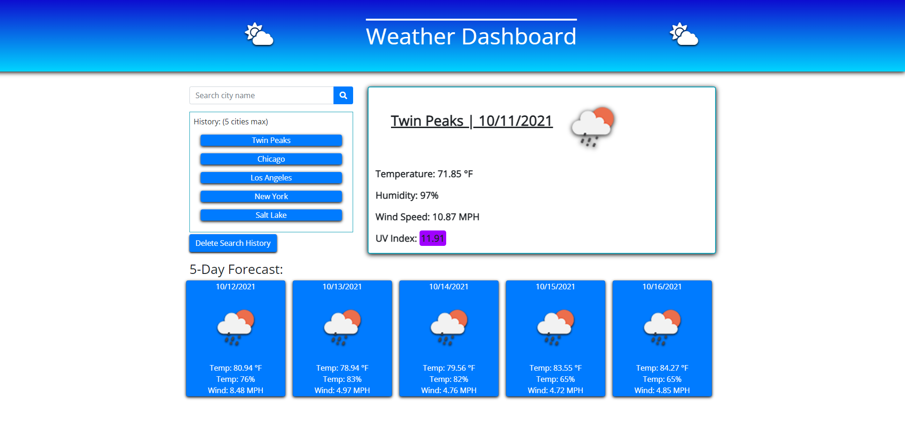

# Weather Dashboard
site live at: https://t-norm.github.io/weather-dashboard/
--
This application uses third party server side API data to pull weather data. 
A user will be able to search for a given city and will see the current forcast for the given city. 
The forcast includes current temp., wind, humidity, a color coded UV index, and a five day forecast.
The dashboard will also include a city search history and persistent local storage.
--

